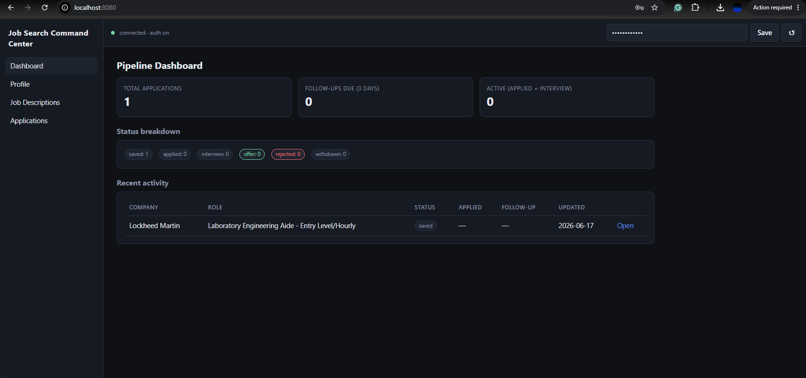
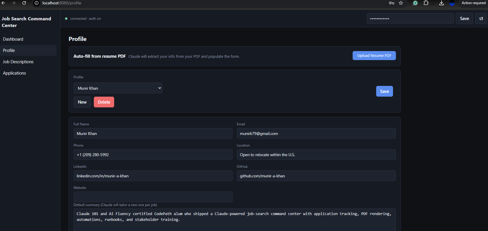
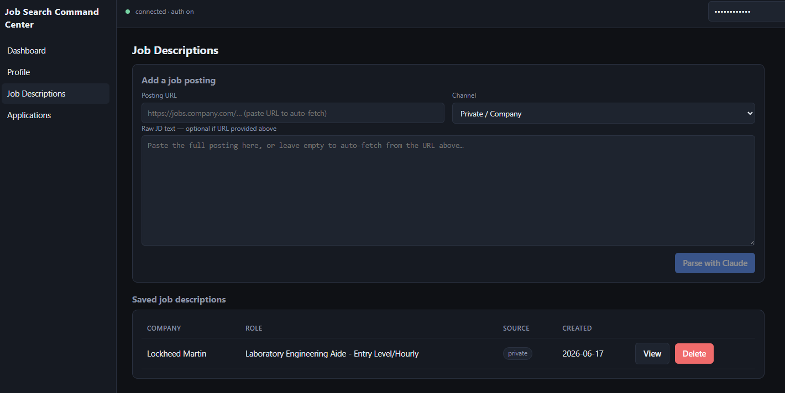
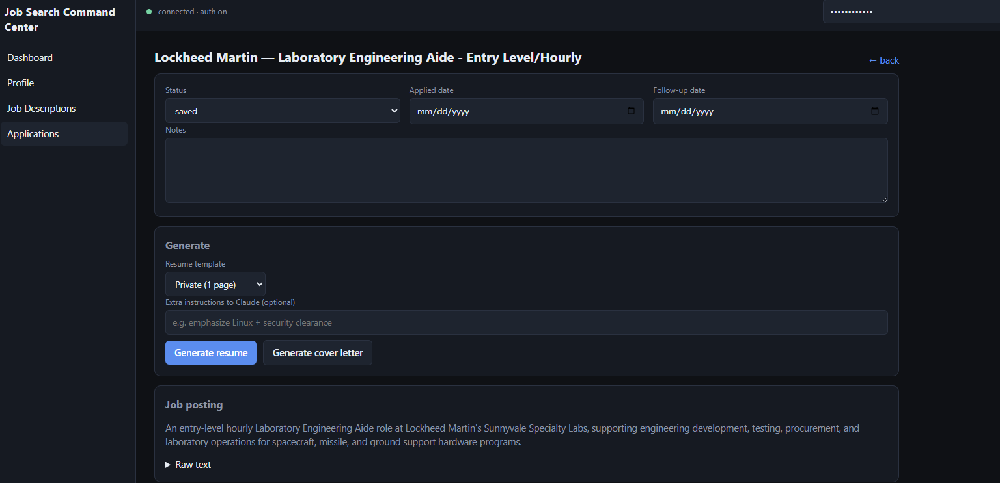
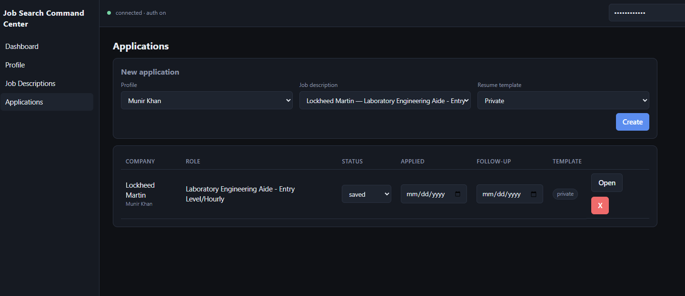
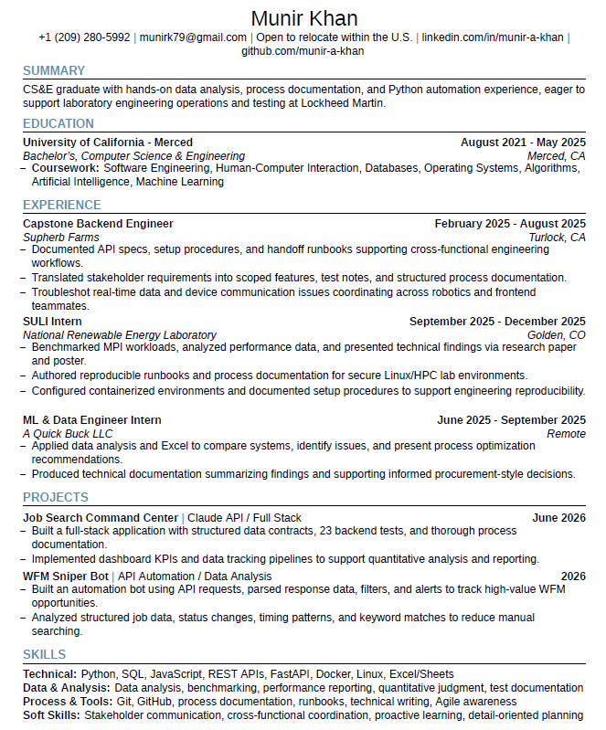

# Job Search Command Center

> A fully dockerized, **AI-powered** web app for running an entire job hunt end-to-end — pasting postings, tailoring resumes, drafting cover letters, and tracking the pipeline. Built around the **Claude API** as the engine for every language task.


**Powered by the [Claude API](https://www.anthropic.com/claude) (`claude-sonnet-4-6`) · PDF compilation by [Tectonic](https://tectonic-typesetting.github.io/) · 23 backend tests passing**

---

## Screenshots

| Dashboard | Profile — Resume Upload |
|:---------:|:-----------------------:|
|  |  |

| Job Descriptions — URL auto-fetch | Application Detail — Generate |
|:---------------------------------:|:-----------------------------:|
|  |  |

| Applications tracker | Claude-tailored resume (PDF output) |
|:--------------------:|:------------------------------------:|
|  |  |

---

## What it does

| Feature | What it actually runs |
| --- | --- |
| **Job Description Parser** | Drop a job posting URL — the backend auto-fetches and scrapes the page, then Claude extracts company, role, must-haves, nice-to-haves, ATS keywords, and responsibilities. Raw text paste is still supported. |
| **Resume PDF Upload** | Upload your existing resume PDF; Claude reads it and pre-fills the entire profile form — name, contact info, work history, education, projects, skills — in one click. |
| **Resume Tailor** | Claude rewrites your bullet points to mirror the JD, then Tectonic compiles a real PDF (private / federal / state template). |
| **Cover Letter Generator** | Claude drafts a short, sincere, no-fluff cover letter that cites real accomplishments from your profile. |
| **Application Tracker** | CRUD over applications — status, applied/follow-up dates, notes, generated artifacts. |
| **Pipeline Dashboard** | Live KPIs, status breakdown, recent activity, follow-ups due in the next 3 days. |

---

## Why this project leans on Claude

The whole app is a case study in **using a frontier LLM as a load-bearing component of a product**, not as a side-bar chatbot. Every screen that produces language ships through Claude:

- **Structured JD extraction** uses Claude with a strict JSON-shape contract (see [`backend/app/services/jd_parser.py`](backend/app/services/jd_parser.py)). The system prompt forbids inventing fields, requires conservative empty defaults, and the response is parsed + normalized server-side before it ever reaches the DB.
- **URL scraping** ([`backend/app/services/url_scraper.py`](backend/app/services/url_scraper.py)) strips boilerplate HTML and pipes clean text to the JD parser — SSRF-protected (blocks private/loopback IPs), caps at 14 000 chars, no external services.
- **Resume parsing** ([`backend/app/services/resume_parser.py`](backend/app/services/resume_parser.py)) extracts text from the uploaded PDF with `pypdf` then asks Claude to return a fully structured profile JSON — the same shape the rest of the app expects — without saving it to the database until the user clicks Save.
- **Resume tailoring** ([`backend/app/services/resume_tailor.py`](backend/app/services/resume_tailor.py)) is the hardest prompt in the codebase. It receives the candidate's full structured profile + the parsed JD + a `template_type` flag, and returns a JSON object with a tailored summary, a re-categorized skill matrix, rewritten bullets keyed by `(company, title)`, and an explicit `missing_keywords` + `warnings` array. The prompt is engineered to *refuse* to invent experience, certifications, or metrics; if the JD asks for something the candidate genuinely lacks, the gap is surfaced rather than fabricated.
- **Cover letter generation** ([`backend/app/services/cover_letter.py`](backend/app/services/cover_letter.py)) constrains Claude to three short paragraphs, two cited accomplishments, and a banned-cliché list — proving that prompt scaffolding can produce voice-consistent output without a fine-tune.
- **Defensive parsing** lives in the Claude client wrapper ([`backend/app/services/claude_client.py`](backend/app/services/claude_client.py)). It strips ```` ```json ```` fences, falls back to a regex JSON pull on imperfect responses, and surfaces a clean `ClaudeError` to FastAPI so the UI sees a useful 502 instead of a stack trace.

The model is configurable via the `CLAUDE_MODEL` env var; the default is `claude-sonnet-4-6`.

---

## Quick start

You need Docker Desktop and an [Anthropic API key](https://console.anthropic.com/).

```bash
git clone https://github.com/munir-a-khan/job-search-command-center
cd job-search-command-center
cp .env.example .env
# edit .env: set ANTHROPIC_API_KEY and choose any random string for API_KEY
docker compose up --build
```

Then open **<http://localhost:8080>**.

The `API_KEY` value from your `.env` is automatically baked into the frontend at build time — the top-bar field will be pre-filled, no manual entry needed. The API is also exposed at **<http://localhost:8000>** with interactive docs at `/docs`.

The first build downloads Tectonic + npm packages; expect 3–5 minutes. After that, `docker compose up` is fast.

---

## Architecture

```
              ┌─────────────────────┐         ┌─────────────────────┐
              │   React + Vite UI   │  /api/* │   FastAPI Backend   │
   browser  ──┤  (Nginx :8080)      ├────────►│  (uvicorn :8000)    │
              │                     │ X-API-  │                     │
              │  ApiKeyBar          │  Key    │  routers/           │
              │  ├─ Dashboard       │         │  ├─ profiles        │
              │  ├─ Profile         │         │  ├─ jds             │
              │  ├─ JDs             │         │  ├─ applications    │
              │  └─ Applications    │         │  └─ generate        │
              └─────────────────────┘         │                     │
                                              │  services/          │
                                              │  ├─ claude_client   │──┐
                                              │  ├─ jd_parser       │  │
                                              │  ├─ url_scraper     │  │ Claude API
                                              │  ├─ resume_parser   │  │ (sonnet-4-6)
                                              │  ├─ resume_tailor   │  │
                                              │  ├─ cover_letter    │  │
                                              │  └─ latex_render    │  │
                                              │         │            │  │
                                              │         ▼            │  │
                                              │  Jinja2 → Tectonic   │  │
                                              │         │            │  │
                                              └─────────┼────────────┘  │
                                                        ▼               ▼
                                              ┌─────────────────────┐
                                              │  SQLite + ./data    │
                                              │  (PDFs, .tex, .txt) │
                                              └─────────────────────┘
```

| Layer | Tech |
| --- | --- |
| Frontend | React 18 + Vite, served behind Nginx |
| Backend | FastAPI + SQLAlchemy 2 + Jinja2 |
| AI | **Claude API** (`claude-sonnet-4-6` by default) via the official `anthropic` Python SDK |
| LaTeX | Tectonic (one static binary, no full TeX Live) |
| Storage | SQLite, mounted to `./data` |
| Auth | Bearer-style `X-API-Key` header, constant-time compare, security headers middleware |
| Containerization | Docker + docker-compose |

---

## Three resume formats — one engine

The same profile produces three different resumes depending on the channel you're applying through:

| Channel | Template | Page target | Notes |
| --- | --- | --- | --- |
| `private` | [`private.tex.j2`](backend/app/latex_templates/private.tex.j2) | 1 page | terse, ATS-friendly, what most companies expect |
| `federal` | [`federal.tex.j2`](backend/app/latex_templates/federal.tex.j2) | ≤ 2 pages | USAJOBS-style — hours per week, salary, supervisor, longer bullets |
| `state` | [`state.tex.j2`](backend/app/latex_templates/state.tex.j2) | 1 page | CalCareers / CalJOBS-style — mirrors the duty statement |

Swap them out without touching the rest of the stack — the LaTeX templates are pure Jinja2 and consume a single normalized `profile` + `jd` context.

---

## Security

- All routes require an `X-API-Key` header (constant-time HMAC compare — no timing leaks).
- Security headers on every response: `X-Content-Type-Options`, `X-Frame-Options`, `X-XSS-Protection`, `Referrer-Policy`. `Server` header stripped.
- CORS locked to the origins in `CORS_ORIGINS`; no wildcard fallback.
- URL scraper blocks private/loopback IPs (SSRF protection) and caps content at 14 000 chars.
- `.env` is `.gitignore`d — no secrets in source control.

---

---

## Deeper guides

- **[backend/README.md](backend/README.md)** — API reference, env vars, prompts, LaTeX pipeline, tests, project layout.
- **[frontend/README.md](frontend/README.md)** — page-by-page tour, API client conventions, theming, Nginx proxy.

---

## Truthfulness clause

The resume tailor and cover letter prompts explicitly forbid inventing experience, certifications, dates, employers, or metrics. If the JD requires something you genuinely lack, the response surfaces those gaps under `missing_keywords` / `warnings` instead of fabricating them. The same rule is codified into the [`resume_tailor.py`](backend/app/services/resume_tailor.py) system prompt — see "Rules" in `INSTRUCTIONS`.

---

## Status

23 backend tests passing. End-to-end smoke-tested in Docker:
- Health endpoint returns model and auth state.
- All three resume templates render through Jinja → Tectonic → PDF.
- ATS check (`pypdf` text extraction) flags ligatures and missing keywords.
- Resume PDF upload → Claude parse → profile auto-fill working end-to-end.
- Job posting URL auto-fetch (SSRF-protected scraper) working end-to-end.

## License

MIT.
